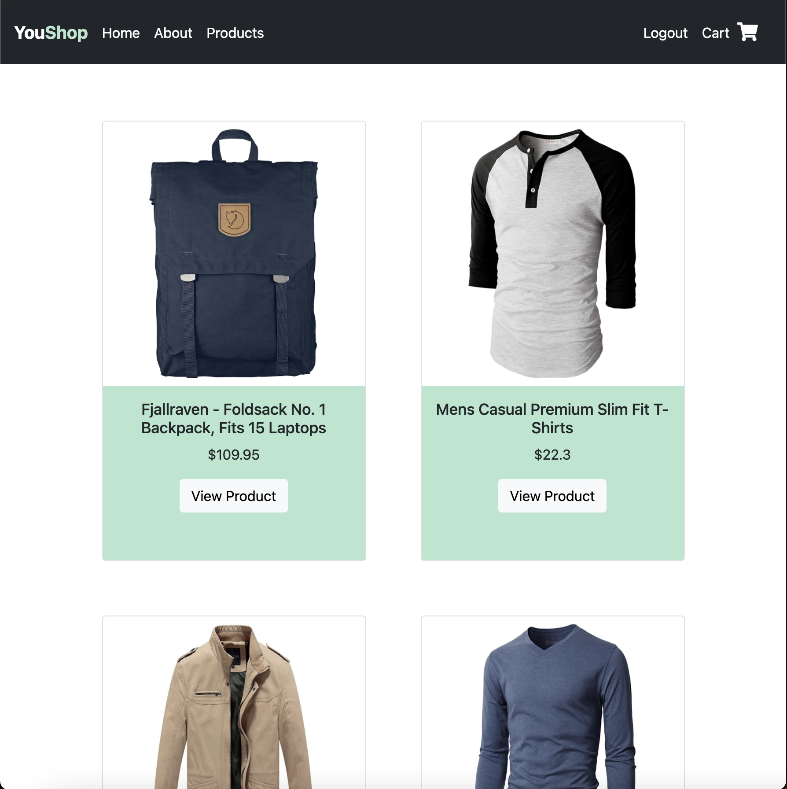
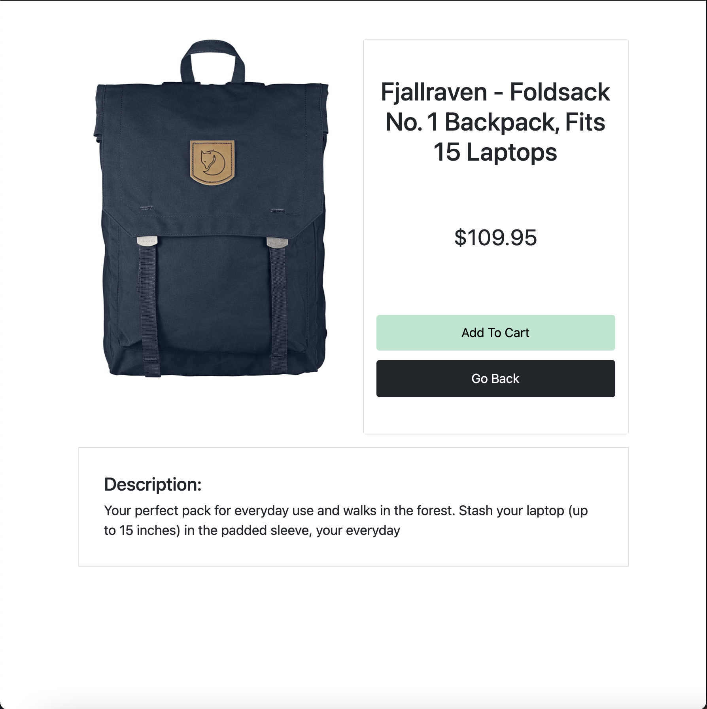
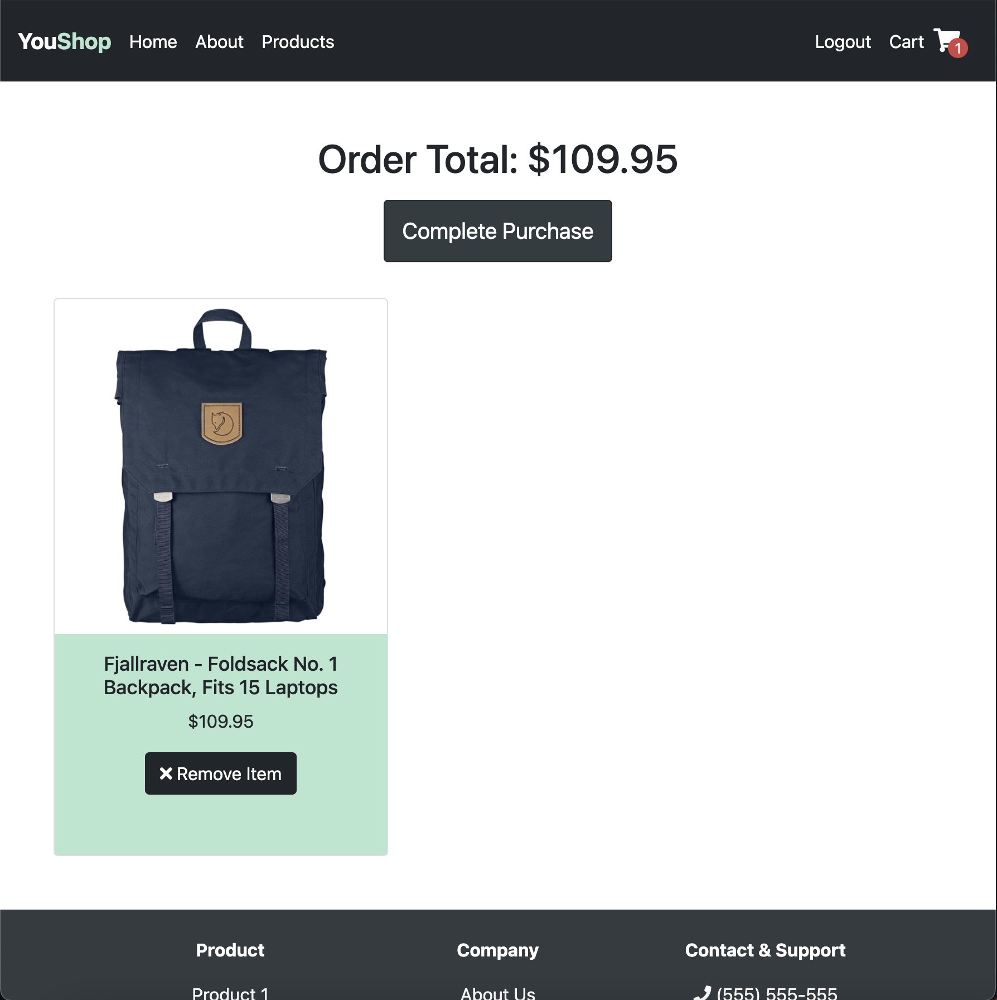
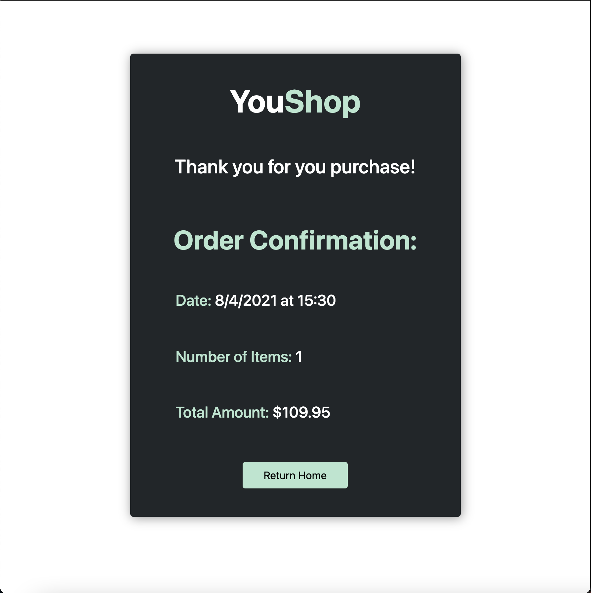

# Full Stack E-Commerce Site

## Description

This is a demo shopping site that uses the Fake Store API to load products for purchase. Key features include user authentication with JWT and a shopping cart where the user can add or delete products to purchase. PostgreSQL was the database mangament tool used for user and cart storage. Node.js was the runtime used and was paired with the Express.js framework.

## Screenshots

  

  

  

  

  

## Technologies Used

**Client Side**

- React/Redux
- React Router
- Styled Components
- React Toastify
- React Bootstrap

**Server Side**:

- Node.js
- Express.js
- JSON Web Token (JWT)
- PostgreSQL
- Sequelize
- Bcrypt

**NPM Packages**:

`Client`:

- “react-redux”: “^7.2.4”
- “react-router-dom”: “^5.2.0”
- “react-scripts”: “4.0.3”
- “react-toastify”: “^7.0.4”
- “redux”: “^4.1.0”
- “redux-logger”: “^3.0.6”
- “styled-components”: “^5.3.0”
- "bootstrap": "^5.0.2",
- "react-bootstrap": "^1.6.1",

`Server`:

- “bcrypt”: “^5.0.1”
- “cors”: “^2.8.5”
- “dotenv”: “^10.0.0”
- “express”: “^4.17.1”
- “jsonwebtoken”: “^8.5.1”
- “sequelize”: “^6.6.2”
- “sequelize-cli”: “^6.2.0”
- “pg”: “^8.6.0”
